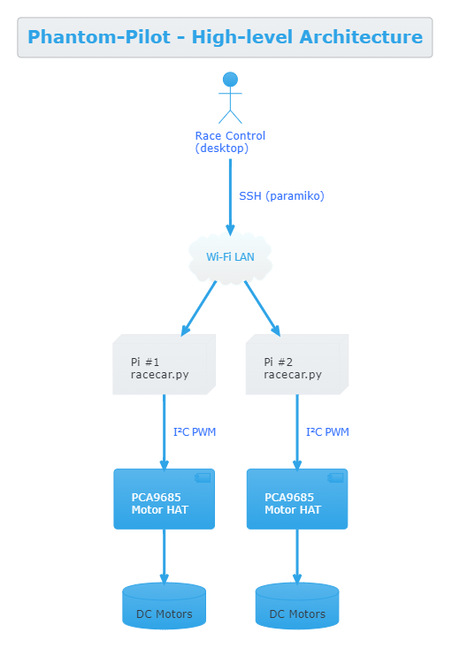

# Phantom‑Pilot 

*Mario‑Kart‑inspired head‑to‑head RC racing platform*

> Two Raspberry Pi‑powered cars duke it out on a living‑room track while a desktop “race control” app fires power‑ups and displays live commentary. Built as a project for Santa Monica Prep’s Engineering Pathway and later demoed at the SMPrep's open house.

---

## Table of Contents

1. [Project snapshot](#project-snapshot)
2. [Features](#features)
3. [Hardware bill of materials](#hardware-bill-of-materials)
4. [Software stack & architecture](#software-stack--architecture)
5. [Getting started](#getting-started)
6. [Running a race](#running-a-race)
7. [Directory layout](#directory-layout)
8. [Roadmap](#roadmap)
9. [Contributing](#contributing)
10. [License](#license)

---

## Project snapshot

|                                                                        |                                                                                                          |
| ---------------------------------------------------------------------- | -------------------------------------------------------------------------------------------------------- |
|                                                                        |                                                                                                          |
|  |  |

---

## Features

- **Real Mario‑Kart inspired mechanics**: lucky blocks randomly grant power mushrooms, invincibility stars, rockets, shells, nitro boosts, or… total crashes.
- **Attribute‑based gameplay**: Each car’s *dimensions*, *luck*, *nitro*, and *power* stats are chosen pre‑race and passed as CLI args. The stats change the probability distribution inside `main.py`.
- **Head‑to‑head over Wi‑Fi**: A single desktop runs *Phantom Pilot Starter* which opens SSH tunnels (via `paramiko`) to both cars and starts the race in sync.
- **Live GUI**: `turtle` renders the traffic‑light countdown and a scrolling log of in‑race events.
- **Fail‑safe threads**: 60‑second kill‑switch, per‑car restart buttons, and clean shutdown once both cars cross the finish line.

---

## Hardware bill of materials

| Qty | Part                                 | Notes                               |
| --- | ------------------------------------ | ----------------------------------- |
| 2   | Raspberry Pi 4 Model B (2 GB)        | Any Pi with GPIO + Wi‑Fi works.     |
| 2   | Waveshare Motor Driver HAT (PCA9685) | 12‑bit PWM, GPIO 0x40 default addr. |
| 4   | TT‑130 DC motors                     | Gear ratio 1:48, 6 V.               |
| 2   | Dual 18650 Li‑ion packs (7.4 V)      | Power both Pi and motors.           |
| 2   | Logitech C270 webcam *(optional)*    | FPV streaming upgrade.              |
| n   | 3D‑printed chassis & kart shell      | See `docs/stl/` for files.          |

### Wiring (quick reference)

| Connection | Pi pin | HAT pin | Notes |
|------------|--------|---------|-------|
| SDA        | GPIO 2 | SDA      | I²C data – default addr 0x40 |
| SCL        | GPIO 3 | SCL      | I²C clock |
| 5 V        | 5 V    | 5 V      | Logic power |
| GND        | GND    | GND      | Common ground |
| Motor L +  | —      | A1       | swap if direction is reversed |
| Motor L –  | —      | A2       |  ”   “ |
| Motor R +  | —      | B1       |  ”   “ |
| Motor R –  | —      | B2       |  ”   “ |
| Battery +  | —      | VIN      | 6–12 V motor supply |
| Battery –  | —      | GND      | connect to common ground |


---

## Software stack & architecture




**Languages / libs**

- Python 3.11
- [`paramiko`](https://pypi.org/project/paramiko/) • SSH client
- [`PCA9685`](https://github.com/waveshareteam/pca9685) • 12‑bit PWM driver
- Standard lib: `threading`, `multiprocessing.pool`, `queue`, `turtle`

---

## Getting started

### 1  Clone & install dependencies (desktop)

```bash
git clone https://github.com/Giabbi/Phantom-Pilot.git
cd Phantom-Pilot
python -m venv .venv && source .venv/bin/activate
pip install -r requirements.txt   # paramiko, adafruit‑blinka, adafruit‑pca9685 …
```

### 2  Prepare each car

1. Flash Raspberry Pi OS Lite. Enable **SSH** & **I²C** in `raspi-config`.
2. `git clone` this repo on each Pi (or `scp` the `Car Code/` folder).
3. `pip install -r requirements.txt` again on the Pi.
4. Bolt the Motor HAT, wire the dual motors to `M1+/M1‑` & `M2+/M2‑`.

### 3  Configure IPs & credentials

Create `hosts.ini` (ignored by Git) in the project root:

```ini
[phantom]
car1 ansible_host=192.168.4.101 user=pi password=raspberry
car2 ansible_host=192.168.4.102 user=pi password=raspberry
```

*(****`Phantom Pilot Starter.py`**** loads these values; hard‑coded defaults are fine for quick demos.)*

---

## Running a race

```bash
python Phantom\ Pilot\ Starter.py
```

The GUI prompts you to pick *dimensions*, *luck*, *nitro*, *power* for each car, then shows a 3‑step traffic light (red → yellow → green). After **GO!!!** both `main.py` instances run on the Pis and stream log lines back to the desktop.

Event codes

| Code | Meaning                        |
| ---- | ------------------------------ |
| 0    | Crash (speed → 0, motors stop) |
| 1    | **Power Mushroom** – size ↑    |
| 2    | **1‑Up Mushroom** – nitro ↑    |
| 3    | **Star** – invulnerability     |
| 4    | **Shell** – stuns opponent     |
| 5    | **Rocket** – +20 speed         |
| 6    | Nitro boost                    |
| 7    | Nerf (oil slick)               |
| 100  | Normal tick                    |

Finish line is reached once `killSwitch()` forces `eventCode = ‑1` **or** speed drops below the minimum.

---

## Directory layout

```
Phantom-Pilot/
├── Car Code/
│   ├── main.py          # Core race logic (runs on Pi)
│   └── Stop.py          # Emergency stop helper
├── Phantom Pilot Starter.py   # Desktop launcher & GUI
├── docs/
│   ├── images/ …        # Build pics
│   ├── stl/ …           # Binary files for 3D print of cars
│   └── UML/             # UML Diagrams 
├── requirements.txt
└── LICENSE (MIT)
```

---

## Roadmap (wish‑list – project frozen)

* **Gameplay polish**
  * Fix the **shell** power‑up bug that can freeze both cars
  * Re‑balance power‑up odds and add a lap counter
* **HUD refresh**
  * Improve the current `turtle` GUI (larger fonts, animated start lights, speed bars)
  * (Stretch) Port HUD to `pygame` for 60 FPS rendering
* **First‑person view**
  * Add Raspberry Pi Camera Module v2 on each car
  * Stream MJPEG to the desktop HUD as picture‑in‑picture
* **Telemetry & analytics**
  * Log race events to CSV and auto‑plot lap times
  * Broadcast live JSON via WebSockets for spectator dashboards
* **Hardware tweaks**
  * Install wheel encoders for accurate speed feedback
  * Swap dual 18650 pack for a 3‑cell Li‑Po + buck converter
* **Code hygiene**
  * Restructure into a `phantom_pilot/` package with a proper CLI (`python -m phantom_pilot`)
  * Add unit tests + GitHub Actions CI


---

## Contributing

Pull requests are welcome! Please run `ruff --fix .` and ensure the race still works in simulation (`python -m phantom_pilot --sim`) before opening a PR.

---

## License

**MIT** © 2025 Giancarlo Umberto Ambrosino. See `LICENSE` for details.
